

    <h1 style="display: inline-flex; align-items: center;">
        
Awesome Latent Communication
    </h1>

    
    
    

This repository manually collects works in **latent communication**, which will be continuously updated.

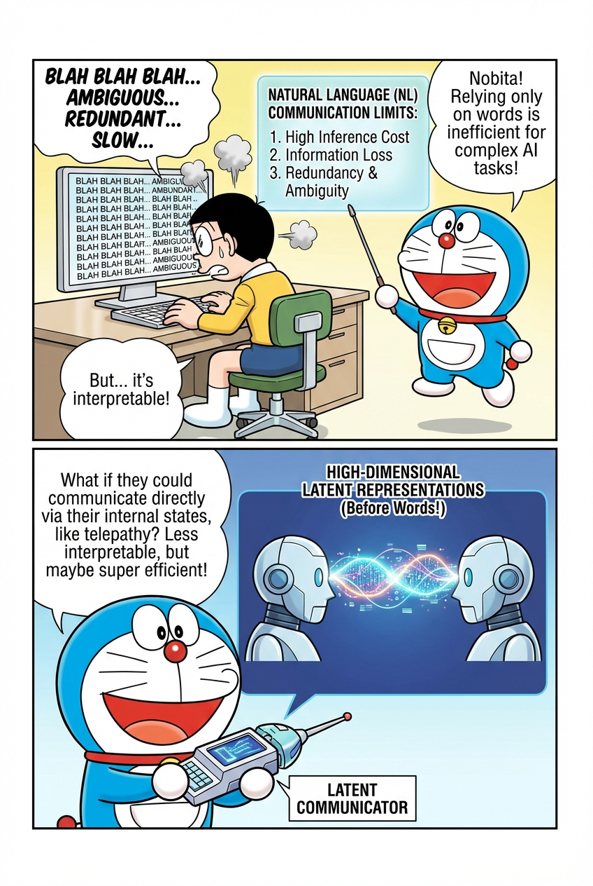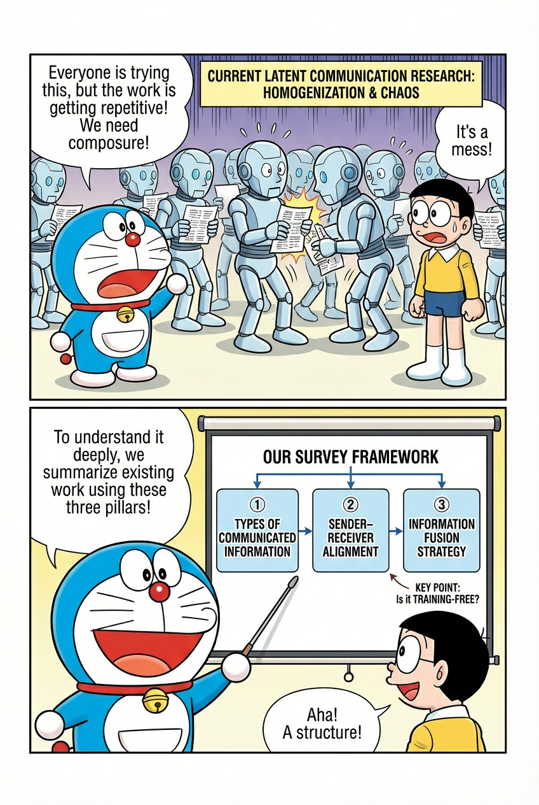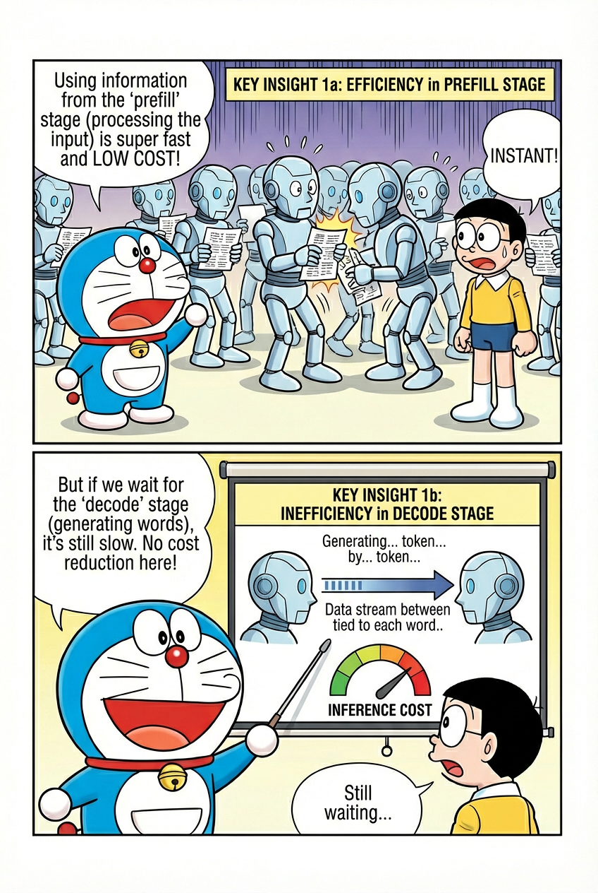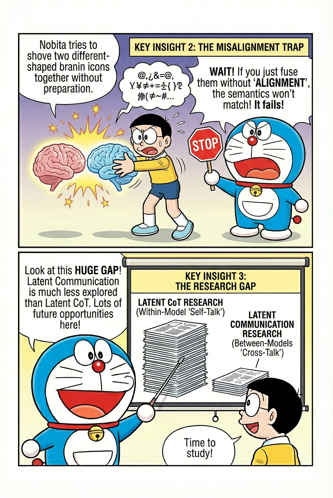

## Updates

- 2026-02-07: 🚀 Latent Communication Repo launched!

## Content

- [Updates](#updates)
- [Content](#content)
  - [1. Natural Language Communication vs. Latent Communication：](#1-natural-language-communication-vs-latent-communication)
  - [2. Preliminary：](#2-preliminary)
  - [3. A Unified Framework for Latent Communication](#3-a-unified-framework-for-latent-communication)
    - [3.1（WHAT）Types of Communicated Information](#31whattypes-of-communicated-information)
      - [3.1.1 Embeddings, Hidden States, and KV-Cache](#311-embeddings-hidden-states-and-kv-cache)
      - [3.1.2 Others](#312-others)
    - [3.2（WHICH）Sender–Receiver Alignment](#32whichsenderreceiver-alignment)
      - [3.2.1 Latent Information Alignment](#321-latent-information-alignment)
      - [3.2.2 Layer Alignment](#322-layer-alignment)
    - [3.3（HOW）Information Fusion Strategy](#33howinformation-fusion-strategy)
  - [4.Other Key Points](#4other-key-points)
    - [4.1 Training-Free](#41-training-free)
  - [5. Latent Communication vs. Latent CoT：](#5-latent-communication-vs-latent-cot)
  - [6. Related Works](#6-related-works)

### 1. Natural Language Communication vs. Latent Communication：

**Limitations**

- **High inference cost**:
   Each interaction requires exhaustive token-by-token decoding to explicitly verbalize the contextual reasoning process, leading to substantial computational overhead.
- **Information loss during discretization**:
   The communication pipeline typically follows
   <u>*early-layer model outputs → vocabulary-level probability distribution → sampled token*.</u>
   Representing the model’s confidence over the entire vocabulary with a single sampled token inevitably causes information loss. In particular, rich high-dimensional internal states are compressed into a sequence of discrete tokens, exposing only a single linear chain of thought while discarding alternative reasoning paths encoded in the latent space.
- **Redundancy and ambiguity of natural language**:
   Generated text is largely optimized for linguistic coherence rather than task-relevant information. Moreover, natural language is inherently ambiguous, containing idiomatic expressions, underspecified references, and vague formulations. When discrepancies exist in background knowledge or role assignments between communicating agents, certain information may become irrecoverable.

**Advantages**

- **High interpretability**:
   Compared to latent representations, natural language communication is significantly more interpretable and accessible to humans, facilitating inspection, debugging, and human–AI interaction.

### 2. Preliminary：

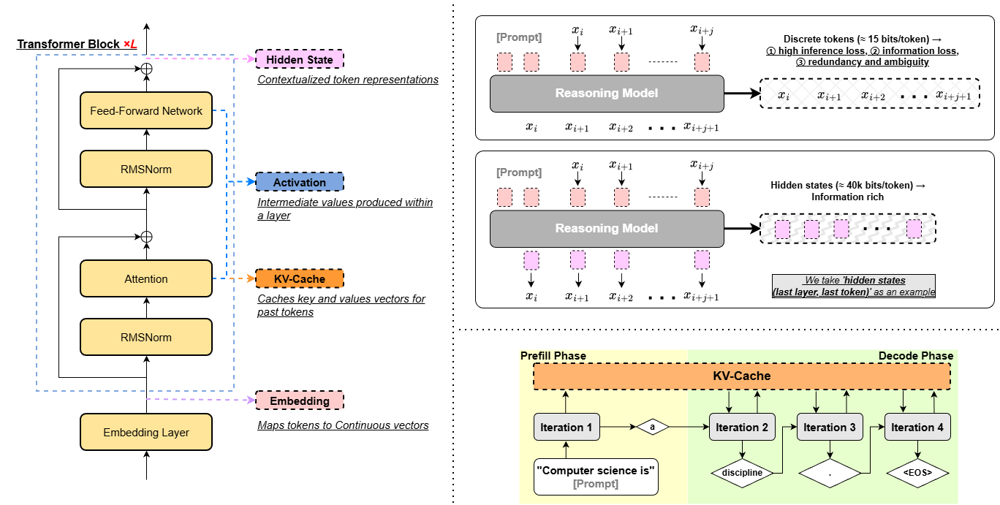

- **Natural Language Communication**: Text-to-Text Communication
- **Latent Communication**: Latent-to-Latent Communication
- **Sender, Receiver**: Information from Sender to Receiver
- **prefill**: Prefill encodes the full input to produce the first output token
- **decode**: Decode generates subsequent tokens iteratively using the last token and the cached key–value (KV) states
- **Embedding**: An embedding is a continuous vector representation that maps discrete input symbols (e.g., tokens) into a dense semantic space, serving as the input to the Transformer model. 
- **KV-Cache**: KV-Cache stores the key and value tensors computed from previous tokens in self-attention layers, enabling efficient autoregressive decoding by reusing past computations. After prefill, LLM produces a per-token KV-Cache. 
- **Hidden State**: We refer to the intermediate activation values that are passed between adjacent layers as hidden states.
- **Activation**: In Transformer models, *activations* refer to the outputs of arbitrary intermediate computations, including attention projections and feed-forward transformations, whereas *hidden states* are the layer-wise token representations after a complete Transformer block. Hidden states can be viewed as a specific subset of activations that serve as stable semantic representations passed across layers.

### 3. A Unified Framework for Latent Communication

> 🔍 **Motivation** 
> Recently, an increasing number of studies have focused on latent communication. We observe that many of these works share substantial similarities, which has led to a tendency toward homogenization. Moreover, there is still a lack of a unified framework to systematically organize and summarize existing research. To address this issue, we review prior work from three key perspectives: **Types of Communicated Information**, **Sender–Receiver Alignment**, and **Information Fusion Strategy**. Under this unified framework, existing studies can be systematically categorized and analyzed in a coherent manner.

#### 3.1（WHAT）Types of Communicated Information

##### 3.1.1 Embeddings, Hidden States, and KV-Cache

In latent communication, the information exchanged between agents can take diverse forms, such as **Embeddings**, **Hidden States**, and **KV-Cache**. 

|                  | **CIPHER** | **AC** | **Interlat** | **SDE** | **KVComm** | **Cache-to-Cache** | **LatentMAS** | **ThoughtComm** |
| ---------------- | ---------- | ------ | ------------ | ------- | ---------- | ------------------ | ------------- | --------------- |
| **Embedding**    | ✅          |        |              |       |            |                    |               |                 |
| **Hidden State** |            | ✅      | ✅            | ✅       |            |                    |               | ✅               |
| **KV-Cache**      |            |        |              |         | ✅          | ✅                  | ✅             |                 |

##### 3.1.2 Others

After identifying the type of communicated information, it is also necessary to specify which information is transmitted. This involves determining:

<u>*(It should be noted that the above discussion is presented from the perspective of the Sender, i.e., referring to the communicated information transmitted from the Sender to the Receiver.)*</u>

- **prefill phase** or **decode phase**: whether the communicated information is computed during the prefill phase or the decode phase.
- **which layer or layers**: from which layer or layers is the communicated information computed. The term <u>**“selected layer(s)”**</u> denotes the layers that are selected according to various possible selection strategies; detailed descriptions can be found in Section 3.2.
- **which token or tokens**: from which token(s) at that layer(s) is the communicated information computed. The term <u>**“last token”**</u> refers to the token at the current autoregressive step whose hidden state is used to predict the next token. In the prefill phase, this corresponds to the final token of the input prompt; in the decode phase, it corresponds to the most recently generated token.

| Method         | Introduction |
| ------------------ | ------------------------------------------------------------ |
| **CIPHER**         | **<u>decode phase</u>**, **<u>last layer</u>**, **<u>last token</u>**, **<u>weighted Embedding**(with weights derived from the model’s output logits)</u> |
| **AC**             | **<u>prefill phase</u>**, **<u>selected layer(s)(n=1)</u>**, **<u>last token</u>**, **<u>Hidden States</u>** |
| **Interlat**       | **<u>decode phase</u>**, **<u>last layer</u>**, **<u>last token</u>**, **<u>Hidden States</u>**|
| **SDE**            | **<u>decode phase</u>**, **<u>all layers</u>**, **<u>last token</u>**, **<u>Hidden States</u>**, **<u>Natural Language Output</u>**。 |
| **KVComm**         | **<u>prefill phase</u>**, **<u>selected layer(s)(n≥1)</u>**, **<u>all tokens</u>**, **<u>KV-Cache</u>**|
| **Cache-to-Cache** | **<u>prefill phase</u>**, **<u>selected layer(s)(n≥1)</u>**, **<u>all tokens</u>**,  **<u>KV-Cache</u>**|
| **LatentMAS**      | **<u>prefill phase + decode phase</u>**, **<u>all layers</u>**, **<u>all tokens</u>**, **<u>KV-Cache</u>**|

> **Takeaway**: 
> 1. **information**: KV-Cache > Hidden State > Embedding; **cost**: KV-Cache > Hidden State > Embedding; **architecture dependency**: KV-Cache > Hidden State > Embedding
> 2. <u>**KV-Cache** is commonly associated with the **prefill phase**, whereas **Embedding** and **Hidden State** are typically associated with the **decode phase**</u>. One possible explanation is that KV-Cache contains richer information than Embedding and Hidden State; therefore, leveraging only the information from the prefill phase may already be sufficient.
> 3. <u>**KV-Cache** is commonly associated with **all tokens**, whereas **Embedding** and **Hidden State** are typically associated with the **last token**</u>. One possible explanation is that KV-Cache is essentially an explicit storage of contextual memory, whose structure naturally follows a token-wise accumulation over the entire sequence. In contrast, during the decode phase, only the hidden state of the last token is used to predict the next token.
> 4. If only the communicated information obtained during the prefill phase is used, the decode phase can be omitted, thereby significantly reducing inference cost; however, this may also result in the loss of substantial important information.

#### 3.2（WHICH）Sender–Receiver Alignment

##### 3.2.1 Latent Information Alignment

**Latent Information Alignment** focuses on aligning the semantic space of latent representations. Without explicit alignment, directly fusing latent information from the Sender and Receiver may result in semantic inconsistency and negatively affect performance.

|           | **CIPHER** | **AC** | **Interlat** | **SDE** | **KVComm** | **Cache-to-Cache** | **LatentMAS** | **ThoughtComm** |
| --------- | ---------- | ------ | ------------ | ------- | ---------- | ------------------ | ------------- | --------------- |
| **Align** |            |        | ✅            |         |            | ✅                  | ✅           |                 |

##### 3.2.2 Layer Alignment

**Layer Alignment** refers to the correspondence between layers in the Sender and Receiver, specifying from which layer latent information is extracted and to which layer it is injected during latent communication.

| Method         | Introduction |
| ------------------ | ------------------------------------------------------------ |
| **CIPHER**         | Sender **<u>(last layer)</u>** -> Receiver **<u>(first layer)</u>**|
| **AC**             | Sender **<u>(selected layer)</u>** -> Receiver **<u>(selected layer)</u>** |
| **Interlat**       | Sender **<u>(last layer)</u>** -> Receiver **<u>(first layer)</u>** |
| **SDE**            |  |
| **KVComm**         | Sender **<u>(selected layers)</u>** -> Receiver **<u>(corresponding layers)</u>** (one-to-one correspondence (bottom to top), Attention top-k)|
| **Cache-to-Cache** | Sender **<u>(all layers)</u>** -> Receiver **<u>(corresponding layers)</u>** (one-to-one correspondence (bottom to top))               |
| **LatentMAS**      | Sender **<u>(all layers)</u>** -> Receiver **<u>(corresponding layers)</u>** (one-to-one correspondence (bottom to top))                        |

> **Takeaway**: 
> 1. Two relatively simple mapping strategies can be considered:
(1) mapping the last layer of the Sender to the first layer of the Receiver;
(2) mapping all layers of the Sender to the corresponding layers of the Receiver, i.e., the i-th layer of the Sender is mapped to the i-th layer of the Receiver.
> 2. In Layer Alignment, a selection mechanism is often constructed to determine the mapping between layers. Existing selection strategies can be broadly categorized into two types:
(1) selecting layers from the Sender only, while the Receiver performs no additional selection and directly maps them to the corresponding layers (i.e., the i-th layer of the Sender is mapped to the i-th layer of the Receiver). This strategy is primarily applicable when the Sender and the Receiver employ the same LLM architecture, and therefore has limited generality;
(2) independently selecting layers from both the Sender and the Receiver.

#### 3.3（HOW）Information Fusion Strategy

| Method         | Introduction |
| ------------------ | ------------------------------------------------------------ |
| **CIPHER**         | **<u>Concat</u>**: Specifically, at each decoding step, the weighted embeddings corresponding to the previous token from both the Sender and the Receiver are concatenated. |
| **AC**             | **<u>Mathematical Operation</u>**: The Hidden State corresponding to the last token of the Sender’s prompt is combined with the Hidden State corresponding to the last token of the Receiver’s prompt through a specific operation. |
| **Interlat**       | **<u>Concat</u>**: The latent information from the Sender is directly concatenated with the prompt embeddings of the Receiver. |
| **SDE**            | **<u>Mathematical Operation</u>**: The Sender’s state delta is directly added to the hidden state of the corresponding token at the corresponding layer in the Receiver. |
| **KVComm**         | **<u>Prepend</u>**，Specifically, within the same layer, the Sender’s KV cache is prepended to the Receiver’s KV cache. |
| **Cache-to-Cache** | **<u>Mathematical Operation</u>**: The fusion is performed using a learned fuser. |
| **LatentMAS**      | **<u>Prepend</u>**，Specifically, within the same layer, the Sender’s KV cache is prepended to the Receiver’s KV cache. |

### 4.Other Key Points

#### 4.1 Training-Free

|                 | **CIPHER** | **AC** | **Interlat** | **SDE** | **KVComm** | **Cache-to-Cache** | **LatentMAS** | **ThoughtComm** |
| --------------- | ---------- | ------ | ------------ | ------- | ---------- | ------------------ | ------------- | --------------- |
| **Traing-Free** | ✅          | ✅      |              | ✅     | ✅        |                    | ✅            |                 |

### 5. Latent Communication vs. Latent CoT：

As a research direction closely related to Latent Communication, Latent CoT has attracted significantly more attention and produced a larger body of work. Consequently, a clear developmental gap exists between the two paradigms.

- https://github.com/YU-deep/Awesome-Latent-Space
- https://github.com/EIT-NLP/Awesome-Latent-CoT

### 6. Related Works

| **Date**| **Paper Title** | **Introduction** |**Code**|
| --------| --------------- | ---------------- |--------|
| 2024/02 | **CIPHER**: LET MODELS SPEAK CIPHERS:MULTIAGENT DEBATE THROUGH EMBEDDINGS https://arxiv.org/abs/2310.06272 | 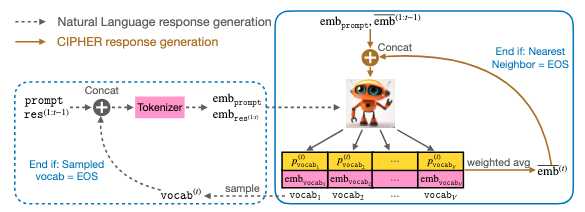 | [Code](https://github.com/chaudatascience/cipher_multiagent_debate?utm_source=chatgpt.com) |
| 2026/01 | **Interlat**：Enabling Agents to Communicate Entirely in Latent Space https://arxiv.org/pdf/2511.09149 | 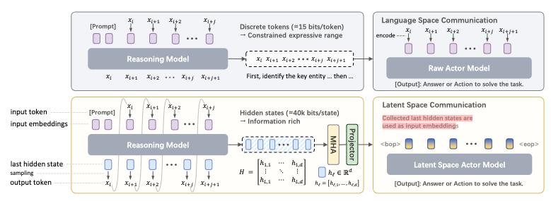 | [Code](https://github.com/XiaoDu-flying/Interlat) |
| 2025/10 | **KVCOMM**：KVCOMM: ENABLING EFFICIENT LLM COMMUNICA-TION THROUGH SELECTIVE KV SHARING https://arxiv.org/pdf/2510.03346 | 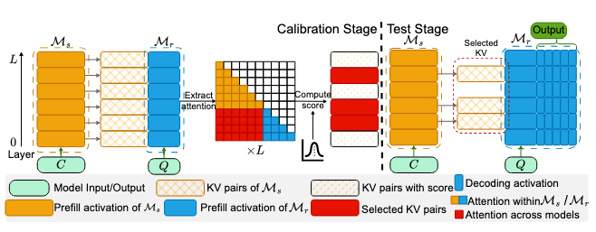 | |
| 2025/10 | **CACHE-TO-CACHE**：CACHE-TO-CACHE: DIRECT SEMANTIC COMMUNICA-TION BETWEEN LARGE LANGUAGE MODELS https://arxiv.org/pdf/2510.03215 | 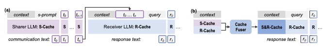 | [Code](https://github.com/thu-nics/C2C)|
| 2025/09 | **SDE**: Augmenting Multi-Agent Communication with State Delta Trajectory https://arxiv.org/pdf/2506.19209 |  | [Code](https://github.com/LittleDinoC/StateDelta/) |
| 2025/12 | **LatentMAS**：Latent Collaboration in Multi-Agent Systems https://arxiv.org/pdf/2511.20639 |  | [Code](https://github.com/Gen-Verse/LatentMAS) |
| 2025/10 | **ThoughtComm**：Thought Communication in Multiagent Collaboration https://arxiv.org/pdf/2510.20733 | 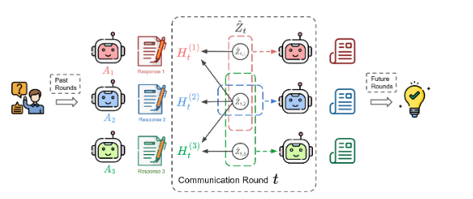 | |
| 2025/05 | **AC**:Communicating Activations Between Language Model Agents https://arxiv.org/pdf/2501.14082v1 |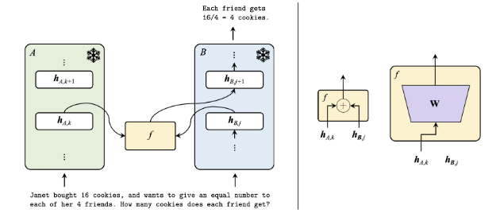 | |
| 2026/01 | MIXTURE OF THOUGHTS: LEARNING TO AGGREGATEWHAT EXPERTS THINK, NOT JUST WHAT THEY SAY https://arxiv.org/pdf/2509.21164 |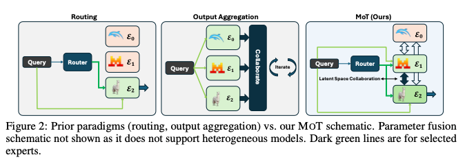 | [Code](https://github.com/jacobfa/mot) |
